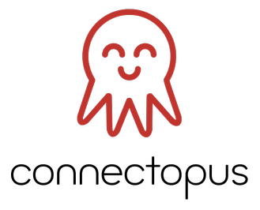

### What is this

### What can it do

### How to get it

Download the [latest build](https://github.com/ghjm/connectopus/releases/tag/latest) for your platform.

### How to run it

### How to build from source

* Install needed distro packages
    * Fedora:
      ```
      sudo dnf -y install curl make findutils direnv util-linux-core nodejs gcc
      ```
    * Ubuntu:
      ```
      sudo apt install -y curl make gcc direnv sudo
      curl -fsSL https://deb.nodesource.com/setup_16.x | sudo -E bash -
      sudo apt install -y nodejs
      ```

* Install Go 1.18 or better

  Use `go version` to check your Go version.  If your distro doesn't include at least 1.18, you can install it locally using:
  ```
  mkdir $HOME/go-1.18.3 && \
    curl -L https://go.dev/dl/go1.18.3.linux-amd64.tar.gz | \
    tar xfvz - --strip-components=1 -C $HOME/go-1.18.3
  ```

* (Optional) Add direnv hook to the shell and authorize the directory.    
  ```
  echo 'eval "$(direnv hook bash)"' >> $HOME/.bashrc
  . $HOME/.bashrc
  direnv allow
  ```
  For shells other than bash, consult https://direnv.net/docs/hook.html.
   
  You can create an `.envrc.local` file with your own settings.  One use of this is if your distro has an older Go version, to make sure that Go 1.18 is added to your path whenever you cd into this directory, like this:
  ```
  echo PATH_add $HOME/go-1.18.3/bin > .envrc.local
  ```

* Build the software
  ```
  make all
  ```

